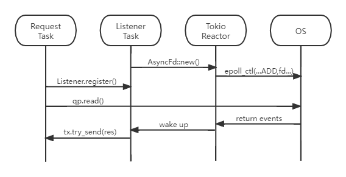

## Asynchronous event listener architecture introduction
### 1. Overview

This article describes the design and implementation methods of the async event listener. Tokio is chosen as the async runtime for this project, and the async-rdma api caller and the event_listener in the following paragraphs are essentially a Tokio task.   

When async api is called, it will register the relevant information with event_listener, and wait to be woken up by event_listener after sending the request. When event_listener receives the completion message, it will wake up the corresponding caller by channel.

### 2. Implementation
EventChannel is a member of CompletionQueue, and it's fd can be used to register I/O events with the OS that you want to be listened for. Epoll is a widely used event notification mechanism in Linux, and most other operating systems provide similar mechanisms. Registration and listening can be done using a separate thread through epoll's api, but there are frameworks that encapsulate the system call layer such as Mio.    

Mio is a low level library, and Tokio's asynchronous IO reactor is realized based on it. We could implement our listener based on Mio or Tokio, but Mio is so low-level that we would need to write a lot of code similar to Tokio, so we chose Tokio for asynchronous implementation.

#### 2.1 Implementation based on Mio
Mio provides Source trait and SourceFd struct. When we implement Source trait for EventChannel, which can be easily done with SourceFd, we can use the api of Mio to listen for events.   

You can then use IbvEventChannel to register the events to listen on through the register method. Once registered, polling can begin. You can set the timeout period or use None to indicate no timeout. Each event polled carries a Token corresponding to it, which can identify the event source and handle the event accordingly.   

```rust
fn poll_completion_mio(cq_addr: IbvCq,mut channel_addr: IbvEventChannel) -> c_int {
    let cq = cq_addr.inner;
    let mut poll = Poll::new().unwrap();
    let mut events = Events::with_capacity(16);
    const TOKEN: Token = Token(0);
    poll.registry()
        .register(&mut channel_addr, TOKEN, Interest::READABLE).unwrap();
    loop {
        poll.poll(&mut events, Some(Duration::from_millis(10)))？;
        for event in events.iter(){
            match event.token() {
                TOKEN=> {
                    get_wc_from_cq()；
                }
                other_token => {
                    do_other_things();
                }
            }
        }
    }
    ···
```
We can run this loop in a thread or tokio task, but why not just use tokio reactor?

#### 2.2 Implementation based on Tokio
Tokio provides a list of higher layers. With Tokio, We don't have to manage the event loop and the correspondence between Token and Event.   

Tokio provides AsyncFd struct similar to SourceFd in Mio. AsyncFd::new(fd) means that the fd is registered into the Tokio's reactor.   

Asyncfd's readable() method provides an asynchronous polling method. When the Tokio Reactor receives an event associated with the AsyncFD, the method completes and executes user-defined behavior, such as waking up caller task.   

The workflow and the relationship of components as shown below.



### 3. Binding of caller and wc
Correspondence to caller and work completion(wc) is completed by wr_id. Every time you send a request, you need to initialize a ibv_send_wr(The struct ibv_send_wr describes the Work Request to the Send Queue of the QP.), and each receives a ibv_wc(The struct ibv_wc describes the Work Completion attributes.), and both include parameter wr_id, and the corresponding wr and wc have the same wr_id.

So when a caller registers with a listener, the listener generates a random wr_id and stores it into its HashMap as a key. Then create a new channel with the tx side as the value of the HashMap and the rx side as the return value of the registration method along with the wr_id. Caller uses rx side to wait for event_listener to wake up and return value to be passed.

When event_listener receives a WC, it can find the tx in the hashMap based on wc.wr_id, and then wake up the caller. This ensures the correspondence between caller and wc.